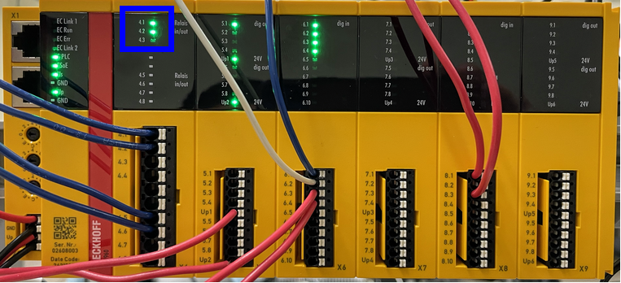
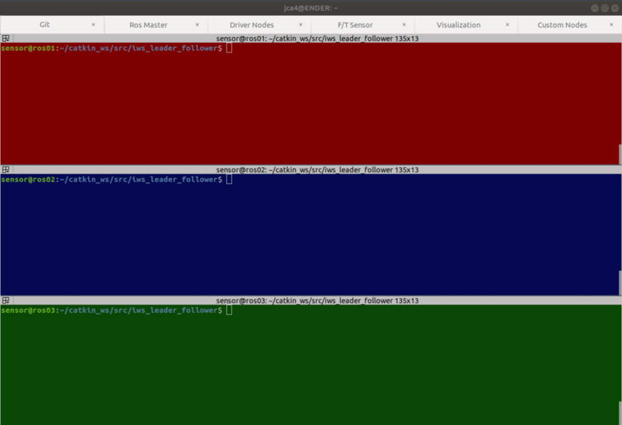

# Running Instructions for Leader Follower Scenario

## Robot Setup

1. If using the safety system turn on the light curtain, wireless E-stop and the safety controller. Check that the outputs to the robot controller (4.1 and 4.2) are green on the safety controller. You may need to press the reset button. If not using the safety system, ensure that the bypass switches are flipped. 

	

2. Turn on both the leader and follower robots using the power button on the teach pendants.
3. Ensure that the both robots are using the magnetic_gripper tcp under the installation page.
4. Load the externalctrl program on both robots but do not yet press play.
5. Ensure that the robot gripper power supply is turned on.
5. Ensure that the metrology bar is correctly seated onto the stand. 

Note: Instructions were written for running on ENDER

## Computer Setup

1. Log into ENDER.
2. Open terminator and type Alt+L to open the layouts pane. Select the leader_follower layout and open. This will open all the terminal windows necessary to run the scenario. 

	

## Terminator Tabs

The scenario has eight default tab groups with some tabs having multiple windows. Certain windows will automatically open an ssh session into one of the three super logics computers that run the various ROS nodes. The windows are color coded to show which computer, red for ROS01 the leader computer, blue for ROS02 the follower computer, and green for ROS03 the supervisor computer. Any terminals running locally will be purple. The terminals are ordered so that starting the scenario requires running the commands in each tab from left to right. The instructions for each tab are as follows.

- **Git**: This tab has four windows, one for each computer. The source code for the scenario is cloned from a local repository on ENDER. If any changes are made on ENDER and commited to the local repository they can be pulled onto the superlogics. To pull the most recent changes enter the following commands. You will need to enter the password. This needs to be done in all three windows. Once all computers have the most recent commit of the repository you can move on to the next tab.

	```
	git pull
	```

- **Time Sync**: This tab is used for synchronizing the internal clocks for each of the super logics computers. Instructions for this can be found [here](wireless_timesync.md)

- **ROS Master**: This tab only has one window for the supervisor computer. To start up a ros master type `roscore`. This only needs to be done once and can remain open for multiple runs of the scenario. Once the ROS master is running you can move on to the next tab.

- **Driver Nodes**: This tab has two windows, one for the leader and one for the follower. These windows will be used to launch the ur_driver nodes for each robot. These driver nodes will be the main interface between the robot controllers and the rest of the ROS system. 

	To bringup the leader driver enter `roslaunch ur3_leader_follower leader_bringup.launch` into the red window.

	To bringup the follower driver enter `roslaunch ur3_leader_follower follower_bringup.launch` into the blue window.

	You should see text in both windows that show that the controllers were loaded and started. 

	At this point you can press play on the robot tablets to establish the connection. You should see text that reads "Robot connected to reverse interface. Ready to receive control commands". Once both windows display this text you can move onto the next tab.

- **Dashboard**: This tab has two windows. One for the leader and one for the follower. By entering the command below you can communicate with the robot's dashboard. Commands are available [here](https://www.universal-robots.com/articles/ur/dashboard-server-e-series-port-29999/).

	```
	python dashboard_socket.py
	```

- **Camera**: This tab is for starting the camera_node and motion_trigger_mechanism node.

	To start the camera enter `rosrun ur3_leader_follower camera_node.py`

	To start the motion trigger mechanism on the raspberry pi enter `rosrun motion_trigger_mechanism motion_trigger_mechanism_node.py`

- **RIVA Nodes**: This tab has two windows for RIVA.
	
	To start the force torque sensor enter the command `roslaunch ur3_leader_follower ft_sensor.launch`. 

	To start the ground truth error node `rosrun gt_error gt_error_node.py`.

- **Custom Nodes**: This tab has three windows, one for each computer. These windows are used to launch the main nodes for the scenario. To start we need to lauch the leader and follower nodes. These nodes will host various ROS services and actions that the supervisor will use to run the scenario. 

	To start the leader node via UDP, type `roslaunch ur3_leader_follower leader_start.launch` into the red window.
	If you want to start via TCP, type `roslaunch ur3_leader_follower TCP_leader_start.launch`
	Here's an example on how modify the following parameters (ee_speed, angle_offset, feedback) 
	`roslaunch ur3_leader_follower TCP_leader_start.launch ee_speed:=0.15 angle_offset:=0.15 feedback:=True`
	Note: angle_offset is used for error correction and is measured in radians, error correction is currently designed for the circle sequence. 

	Varying the parameters can result in several scenarios.
	Case 1, angle_offset = 0 and feedback = False
		No error correction is being done between the leader and follower robots. One-way stream from the leader to the follower.
	Case 2, angle_offset = x : x is not 0 and feedback = False
		Constant error correction where the desired pose sent to the follower is x radians ahead of the leader's current pose. One-way stream from the leader to follower.
	Case 3, angle_offset = x for any x and feedback = True
		Error correction that is dependent on the feedback from the follower. The initial angle is x and is modified based off of the filtering constant alpha (hard-coded in leader.py & TCP_leader.py) and current cartesian error, updated every pose. Two-way stream between the leader and follower.


	To start the follower node via UDP, type `roslaunch ur3_leader_follower follower_start.launch` into the blue window.
	Similarly, if you want to start via TCP, type `roslaunch ur3_leader_follower TCP_follower_start.launch`
	The follower currently has only one modifiable parameter, being the feedback. Here is how to set it:
	`roslaunch ur3_leader_follower follower_start.launch feedback:=True`
	Note: This feedback parameter should match that used by the leader node.

	Both windows will display a message saying that they are ready to receive action goals.

	To start running the scenario type `roslaunch ur3_leader_follower supervisor.launch` into the green window. At this point the robots will begin the grip sequence. Both robots will move through various poses to seat the ends of the bar into the socket on the gripper, then turn on the electromagnet. The robots will then add a small amount of preload to the bar. At this point the green terminal window will display a prompt asking the user if they would like to run through the sequences. These sequences are stored in the config folder of the repository in sequences.yaml. If the user enters `y` the robots will move through the sequences, then ungrip the bar and return to the home state. If the user enters `n` the robots will ungrip the bar and return to the home state without running the sequences. 